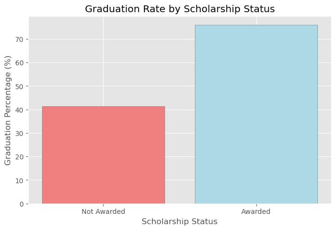
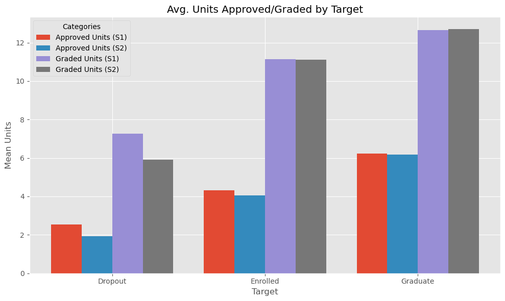

# Predicting Student Outcomes with Machine Learning
Author: Elijah Lopez

## Overview
This analysis reveals key predictors of student outcomes, emphasizing the influence of class time, scholarship status, credit approval trends, and graded units on student outcomes (dropout, continued enrollment, and graduate). Results indicate that students in morning classes experience better outcomes compared to those in evening classes, with the latter group showing a higher dropout risk. Scholarship recipients also have notably higher graduation rates. Additionally, students who experience a significant drop in approved credits from first to second semester are more likely to drop out, while students who maintain or increase their graded units tend to continue or graduate. These findings inform several actionable recommendations, such as targeting at-risk evening students for additional support, emphasizing scholarship access, and monitoring credit approvals to identify and intervene with students at risk of not progressing. By implementing these strategies, institutions can enhance student success rates and reduce dropout risks.

## Business Problem
Student outcomes are crucial to a variety of stakeholders. Successful students gain better employment opportunities, while educational institutions enhance their credibility and reputation. Furthermore, positive student outcomes play a key role in helping institutions secure funding from both government sources and private donors. Key metrics such as dropout rates, continued enrollment, and graduation rates are of utmost importance to these stakeholders. This report examines the leading indicators for each outcome and incorporates a machine learning prediction model to identify students at risk of dropping out. By identifying at-risk students early, academic advisors and student services can proactively intervene and develop tailored strategies to improve their chances of graduating.

## Data
This data was originally published in Advances in Intelligent Systems and Computing and was accessed through [UCI Machine Learning Repository](https://archive.ics.uci.edu/dataset/697/predict+students+dropout+and+academic+success). It contains data for roughly 4,400 students, measured across 35 features + outcome ('Dropout', 'Enrolled', 'Graduate'). It included a mixture of demographic data from the student and their parents as well as performance by unit counts for semesters 1 and 2. The data was further categorized by binary, cardinal, ordinal, other categorical, and numeric types.
* ~4,400 students
* Measured on 35 features + outcome
* Mix of:
    * Demographics, including parent backgrounds
    * Student performance in two semesters
* Data further categorize by:
    * Binary features
    * Cardinal features
    * Ordinal features
    * Other categorical
    * Numeric features

## Methods
I first focused on categorical features, performing statistical tests for:
* Rate of Student Outcomes by Class Time (morning and evening)
* Rate of Student Outcomes by Displacement
* Graduation Rates vs Scholarship Status

Next I focused numeric features, performing statistical tests for:
* Student Outcomes vs Units Approved
* Student Outcomes vs Units Graded

Finally, I creeated a machine learning model.
Initially, I tested several variations of model to determine baseline performance. XGBoost was most promising. In attempt to tune the model and improve performance I handled data in this way:
* Binary features - Left intact
* Cardinal features - Utilized target encoding
* Ordinal features - Ranked and reordered label types to be more logical
* Other categorical - Utilized one hot encoding
* Numeric features - Compared standard scaling and min/max scaling

I also attempted model improvements through:
* Resampling using SMOTE
* GridSearch hyperparameter optimization

## Results
### Student Outcomes vs Class Time

* Students who take morning classes experience higher rates of graduation and continued enrollment compared to those that take evening classes.
* Students that take evening classes are more likely to drop out compared to other students.
* Statistical Analysis using an alpha = 0.05 shows that these findings are significant.

### Student Outcomes vs Displacement

* Initial thought was that displacement would lead to worse student outcomes (higher drop out rate / lower graduation rate).
* This sample demonstrated the opposite; Displaced students better student outcomes.
* Statistical Analysis using an alpha = 0.05 showed that the two groups (Displaced & Not Displaced) were NOT significantly different.

### Graduation Rates vs Scholarship Status

* Students that are awarded scholarships experience higher graduation rates than those thar are not.
* Statistical Analysis using an alpha = 0.05 shows that these findings are significant.

### Student Outcomes vs Units Approved & Units Graded

* All student groups (Dropout, Enrolled, Graduates) experience a decrease in approved credits from first semester to second semester.
* Dropouts perform worst from first semester to second semester with an average decrease in approved units of almost half a unit more than other student groups.
* Statistical Analysis using an alpha = 0.05 shows that these findings are significant for all groups.

* Units graded is about 40-50% less for students that end up dropping out. This could be due to a number of factors such as financial constraints, difficulty handling the rigor of the college courses, or seriousness about degree program. Meetings with academic advisors may help tease out these challenges to open up more opportunities for student outcomes.
* Statistical Analysis using an alpha = 0.05 shows:
    * Dropouts showed a statistically significant decline in units graded
    * Enrolled students showed no statistical difference in units graded.
    * Graduates showed a mild, but statistically significant, increase in units graded. 

### XGBoost Model
* Baseline accuracy was 78.58%. 
* Scaling numerical data had no affect on XGBoost performance
* Target encoding cardinal features had no effect on XGBoost performance
* Reranking ordinal features in a more logical way had no effect on XGBoost performance
* One hot encoding had a negative effect on XGBoost memory usage
* Hyperparameter tuning was completed two times to determine best values in a successively concentrated range. These were determined to be:
    * 'learning_rate': 0.1
    * 'max_depth': 3
    * 'n_estimators': 200
    * 'subsample': 1
* Through SMOTE resampling I was able to boost model performance
* Feature selection using feature importances failed to improve the model
* Model performance was 78% accuracy on training data
* Testing revealed 76% accuracy, demonstrating strong generalization.

## Conclusions
This analysis leads to 5 recommendations for 

1. Academic advisors should work with students to create a course schedule that prioritizes daytime classes. Additionally, students taking evening classes should be marked as "at-risk" and conferences should be set with Student Services to determine and offer appropriate support for these students.

2. Displacement is not a significant predictor of student outcomes. Focus on other variables.

3. Student services should work with students on an individual basis to make them aware of scholarship opportunities and help them apply for those that they qualify for.

4. Academic advisors and Student Services should collaborate with students who show a significant drop in approved credits from the first semester to the second semester. By understanding the factors contributing to the decrease in credit approval, they can provide personalized support and solutions to help these students stay enrolled and progress toward graduation.

5. Use XGBoost Model to flag students that are at risk of dropping out and implement a proactive intervention strategy to offer support. 

## Next Steps
*  * Take a comprehensive approach to identify students who are at highest risk of dropping out. This includes factoring in students that:
    * Take evening classes
    * Have lower approved units than average studnet population
    * Experience sharp declines in approved units and units graded
* Schedule meetings with identified students to better understand their situation and decisions surrounding the factors above. During this time academic advisors and/or student services should encourage students to take morning classes, build awareness of scholarship opportunities that the student may qualify for, and offer additional support resources (such as tutoring) as necessary.
* The suggested method of identification is to use the predictive model since it resutled in 76% accuracy.

## For More Information
See the full analysis in the [Jupyter Notebook](https://github.com/elijahlopez94/predicting_student_outcomes_with_machine_learning/blob/main/machine_learning.ipynb) or review this [presentation](https://docs.google.com/presentation/d/1Dztu0CgYZZRJ5c6WN4qeJ0swW_WtZPBUl4YQxz_eA-8/edit?usp=sharing).

For additional info, contact the author at:

Elijah Lopez | elijahlopez94@gmail.com